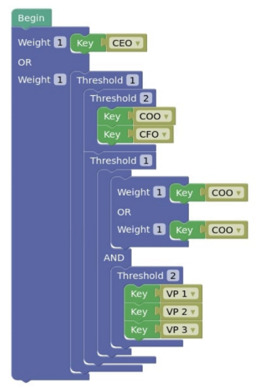

<head>
  <title>Coinstr: Bitcoin signature orchestration on Nostr</title>
  <meta charSet="utf-8" />
  <meta property="og:image" content="https://coinstr.app/articles/2023-02-14-dev-update/coinstr-policy-simple.png" />
  <meta property="twitter:description" content="Coinstr: Bitcoin signature orchestration on Nostr" />
  <meta property="og:description" content="Coinstr: Bitcoin signature orchestration on Nostr" />
  <meta property="og:title" content="Coinstr: Bitcoin signature orchestration on Nostr" />
  <meta property="og:url" content="https://coinstr.app" />
</head>

# Coinstr is Bitcoin spending policy and signature orchestration using Taproot and Nostr

 

[View Coinstr on Github](https://github.com/3yekn/coinstr)
# 🪙 What is Coinstr? 
Coinstr is a multisignature Bitcoin wallet that allows users to configure complex spending policies, like [Bitcoin smart contracts](https://river.com/learn/what-are-bitcoin-smart-contracts/). When a spending proposal is made, Coinstr uses the Nostr protocol to orchestrate signature requests and approvals. 


@startmindmap
+[#orange] Coinstr
++[#yellow] Coin/UTXO Control
++[#lightgreen] Send Signature Requests to Users
++[#yellow] Receive Signatures
++[#yellow] Broadcast Transactions
--[#lightgreen] Bitcoin Wallet
--[#lightgreen] Build Spending Policies
--[#yellow] Apply Spending Policies to Users
--[#lightgreen] Create Spending Proposals
@endmindmap

# 🗒️ What is Nostr?
[Nostr](https://nostr-resources.com/) is one of the most interesting new projects I've come across in quite some time. It is a protocol for decentralized social media, among other things. 

Twitter, like most web 2.0 products, uses your email address and password to authenticate to you to their services, and then they let you read and write to those services as they wish. This model has a number of problems.
1. Products are monetized through advertising, creating a dark underbelly of paid influence.
2. The company owns all of **your** data instead of the **you**, the content creator.
3. The company decides how information is featured, censored, and how it is shared.

Just as Bitcoin is freedom money, Nostr is freedom media. It uses a similar architecture.

Nostr accounts are comprised of a public and private key pair, where **only** the user has access to the private key. The network is distributed across open source, independently operated [relays](https://nostr-resources.com/#relays), which are "dumb servers that you can leave behind at any time (so they can’t turn evil). You need to connect your client to a relay for it to work. There are many relays & you can run your own."

When you post a comment or note (like a tweet), you submit it to multiple relays and it can then be queried by clients. Just as their are multiple implementations of Bitcoin nodes and clients (wallets), there are multiple implementations of relays and Nostr clients. Most of them are open source. 

I enjoy using [Damus](https://damus.io) on iOS, and I've been building Coinstr with [open source rust libraries](https://github.com/rust-nostr/nostr). 

# 💸 Spending Policies
If you have a teenager, you will recognize the block shapes in the diagram below as the [Blockly](https://developers.google.com/blockly), the tool of choice used to teach kids to code.

However, in Coinstr, the blockly shapes are used to build criteria for which Bitcoin may be spent. 

The example below configures a policy that only allows funds to be spent if one of the following criteria is met: 
1. CEO approves 
2. Both the COO and CFO approves
3. Either the COO or CFO plus 2 VPs

This type of policy is commonly known in business as a delegation of authority, and these are standard operating procedures in most corporate environments. 

The Coinstr blockly interface is inspired by [Bitcoin Development Kit's Elephant product](https://github.com/bitcoindevkit/elephant).

# 🎶 Signature Orchestration
When Bitcoin in this wallet is being spent, 6 signature requests must be created and sent to the corresponding parties with the appropriate data about the spending proposal. For example, it should include what it is being spent on, perhaps an invoice number, who is receiving the payment, etc. 

This is where Nostr comes in. 

Nostr uses [Schnorr signatures](https://river.com/learn/what-are-schnorr-signatures/), which is the same crytographic primitive used for Bitcoin spending policies (namely Taproot). So the Nostr clients already have ready access to the private key(s) and signing libraries to also sign Bitcoin transactions.

The users will each receive a notification that they have a new spending proposal to review, which they can evaluate and approve or deny in just a few taps. 

# 🛡️ Security
Using a distributed protocol like Nostr for orchestration of signature requests removes intermediaries such as wallet developers or centralized exchanges from the spending process, making it much more secure. 

Some users may sign with a Twitter-like app (e.g. Damus), some may use a hardware wallet, and some may use a browser plugin. Since Coinstr uses only core Bitcoin protocols, it is compatible with users who may not even be using a Nostr client. 

Coinstr is fully open source and relies on no intermediaries for safe and stable usage. 

# 👨‍💼 Extended Functionality 
In the real world, spending policies often require some sequencing. For example, a CFO may not want to even see a spending request until a project manager, purchasing agent, or director has reviewed and approved it. 

Coinstr adds a layer of smart-sequencing to spending policies to make multisignature more practical and user friendly.

# Open Source
Coinstr is MIT and Apache licensed. 